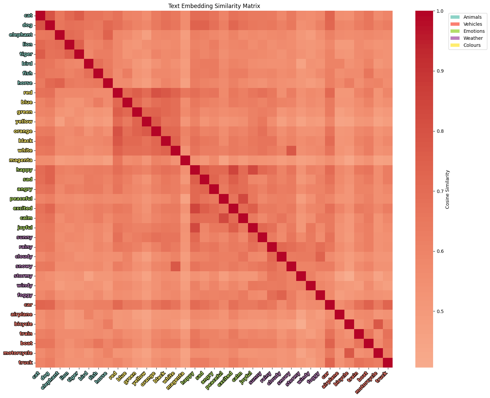
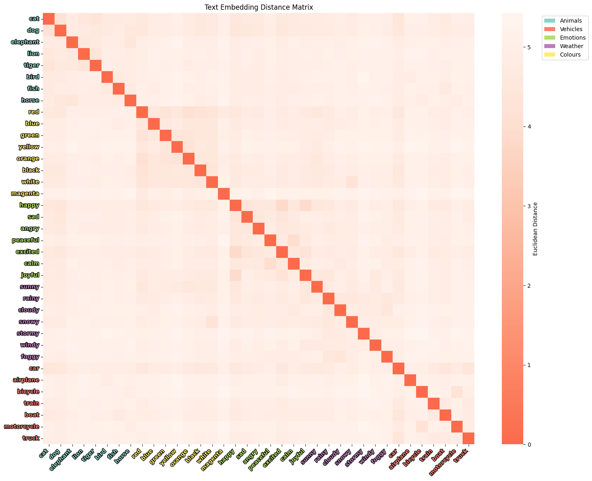
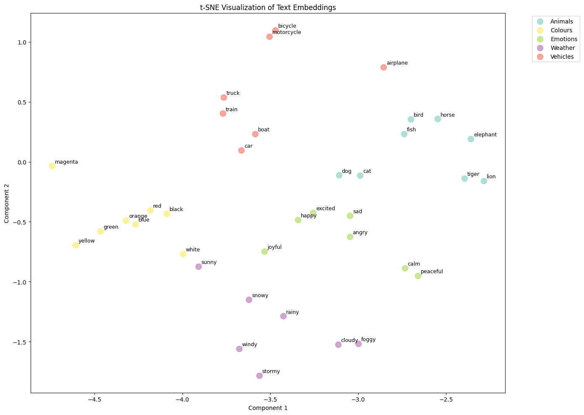
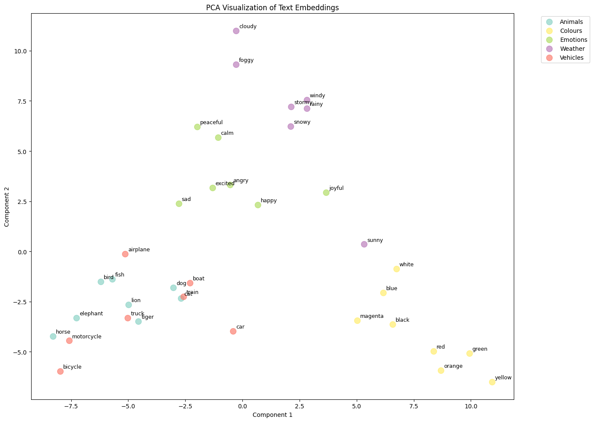

# Diffusion Embedding Analysis

A tool for analysing and visualising text embeddings from image generation diffusion models to understand semantic relationships between concepts.

## Overview
This project provides a framework for extracting and analysing text embeddings from image generation models such as Stable Diffusion. It helps understand how different concepts are represented in the embedding space and how semantically similar concepts cluster together.

## Features
- **Text Embedding Extraction**: Extract embeddings from Stable Diffusion's text encoder (CLIP)
- **Similarity Analysis**: Calculate cosine similarity and Euclidean distances between concepts
- **Visualisation**: 
  - Heatmaps of similarity/distance matrices
  - 2D visualisations using t-SNE and PCA
- **Statistical Analysis**: Compare intra-category vs inter-category similarities
- **Concept Clustering**: Analyse how well concepts cluster by semantic meaning

## Files
- `embedding_analysis.ipynb`: Jupyter notebook with example usage and experiments

## Usage

### Basic Example
```python
from diffusionEmbeddingAnalyser import DiffusionEmbeddingAnalyser

#initialize analyzer
analyser = DiffusionEmbeddingAnalyser() #provide model name argument if needed

# define concept groups
concept_groups = {
    'Animals': ['cat', 'dog', 'elephant', 'lion'],
    'Colors': ['red', 'blue', 'green', 'yellow'],
    'Emotions': ['happy', 'sad', 'angry', 'peaceful']
}

# Analyse similarities
results = analyser.analyse_concept_similarity(concept_groups)

# Generate visualisations
analyser.visualise_similarity_matrix(results)
analyser.visualise_embeddings_2d(results, method='tsne')
analyser.print_similarity_analysis(results)
```

## Key Methods
- `get_text_embeddings()`: Extract embeddings for text prompts
- `analyse_concept_similarity()`: Compute similarity matrices for concept groups
- `visualise_similarity_matrix()`: Create heatmap of similarities
- `visualise_embeddings_2d()`: 2D visualisation with dimensionality reduction
- `calculate_intra_inter_category_similarity()`: Statistical analysis of clustering

## Visualizations

### Similarity and Distance Matrices
Shows cosine similarity and Euclidean distances between different concepts, with colour-coded labels by category:

<div align="center">
  
  
</div>

### 2D Projection Visualisations
2D projection of high-dimensional embeddings using t-SNE and Principal Component Analysis:

<div align="center">
  
  
</div>

## Requirements
- PyTorch
- transformers
- diffusers
- scikit-learn
- matplotlib
- seaborn
- numpy
- pandas

## Experiments Included
1. **Visual + Conceptual Similarity**: Testing concepts that are both semantically and visually similar
2. **Conceptual Similarity, Visual Difference**: Testing concepts with similar meaning but different visual representations (e.g., biological vs technological implementations of similar functions)

## Results of Experiments
1. **Visual + Conceptual Similarity**: Found high similarity scores for concepts like "cat" and "dog", which are both visually and semantically similar.
2. **Conceptual Similarity, Visual Difference**: Identified that words with similar conceptual meaning have similar embeddings, for example, "solar panel" and "photosynthesis" have similar meanings (both are related to energy from the sun) but differ significantly in visual representation.

## Output

The analysis provides:
- Similarity/distance matrices
- 2D visualisations of embedding space
- Statistical comparisons between categories
- Identification of most/least similar concept pairs